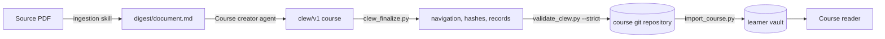

# Course distribution

A course is expensive to produce and cheap to copy. This document describes how
a finished `clew/v1` course travels from the person who produced it to the
people who read it, so the Document Intelligence and vision-model conversion
happens exactly once.

[ADR-0006](adr/adr-0006-course-distribution-and-import.md) records the decision
and its alternatives and remains **Proposed**.



The two roles differ by permission, not by tooling. A learner working alone from
a teacher's PDF is the producer for their own repository.

## Repository layout

A course repository's root is shaped like a vault. There is no bundle format,
archive or manifest: the distribution format **is** the content format described
in the [Clew course structure](../.agents/skills/course-content/references/clew-structure.md).

```text
<course-repo>/
  courses/
    mechanics/
      course.md
      chapters/  sections/  sources/  assets/  support/
    proportional-reasoning/
      ...
  concepts/
    math-ratios.md
    physics-average-speed.md
  README.md
```

Only `courses/<course-id>/` and `concepts/` are imported. Repository tooling,
continuous integration and the producer's own notes may sit alongside and are
ignored.

Because the root is vault-shaped, the existing validator runs against the
repository directly:

```sh
uv run --project <clew checkout> python \
  .agents/skills/course-content/scripts/validate_clew.py \
  --vault <course-repo> --course mechanics --strict
```

## Publishing

The [`Course creator`](../.github/agents/course-creator.md) agent owns this path.

1. Confirm the right to process the source and to redistribute what the
   repository will contain. A PDF that cannot be redistributed is omitted from
   the course with `path: null` and an `omission_reason`, as
   [provenance](../.agents/skills/course-content/references/provenance.md)
   requires. Omitting a PDF does not grant rights to its transcription.
2. Digest the PDF with the [ingestion skill](../.agents/skills/ingestion/SKILL.md).
3. Author `clew/v1` sections, chapters and the course index from the digest,
   reconciling shared concepts and writing `support/source-map.json`.
4. Run `clew_finalize.py` to regenerate everything mechanically derivable.
5. Run the validator with `--strict`.
6. Commit and push.

Never commit learner records, `.clew.local.json`, raw digests, or material the
producer may not redistribute.

### `clew_finalize.py`

```sh
uv run --project <clew checkout> python scripts/clew_finalize.py \
  --root <course-repo> --course mechanics [--check]
```

It regenerates only derived artifacts:

- `previous` and `next` across chapter boundaries, by flattening course and
  chapter `children`, with `null` at the two ends.
- Section `source_refs` from primary spans: one `#page=N` link per included
  page, deduplicated in first-occurrence order.
- Index `source_refs` from the first relevant page of each included primary
  source among descendants, in reading order.
- `## Contents` numbered lists in the course and chapter indexes, from
  `children` order plus each child's `summary`.
- `sha256` and `page_count` for each source in `source-map.json`.
- `markdown_sha256`, `source_map_sha256` and per-page records in
  `verification.json`.

It preserves author-owned content: `fidelity`, `checks`, `limitations`, section
prose and body wording. It never promotes a section to `verified` and never
invents comparison evidence. `--check` reports drift and writes nothing, so a
commit can be gated on it.

## Importing

The [`clew-import`](../.agents/skills/clew-import/SKILL.md) skill owns this path.

```sh
uv run --project <clew checkout> python \
  .agents/skills/clew-import/scripts/import_course.py \
  --source <git-url-or-path> [--ref <branch|tag|sha>] \
  --course mechanics [--course proportional-reasoning] \
  [--vault <path>] [--on-concept-conflict keep|replace] [--force] [--dry-run]
```

The destination comes from `.clew.local.json`, so `--vault` is an override
rather than a required argument. `--ref` defaults to the remote's default
branch.

1. **Stage.** A git source is fetched into a temporary directory with a shallow,
   blobless, sparse checkout limited to `courses/<id>` and `concepts`, and its
   `HEAD` is recorded. A local directory source is read in place and never
   written to.
2. **Check the staged course.** The same fixed-layout whitelist the validator
   applies is enforced, so an import cannot place arbitrary files in a vault.
   Symlinks, reparse points and paths escaping the course directory are refused.
3. **Resolve concepts.** The concepts the course's notes reference are
   collected, then closed over concept-to-concept relationship links.
4. **Filter evidence.** Only evidence links that will resolve in the vault after
   this import are kept.
5. **Reconcile concepts.** See below.
6. **Check the destination.** Each existing course file is compared against the
   hash recorded at import.
7. **Write.** Content is staged inside the vault and then moved into place, and
   `.clew/imports.json` is rewritten atomically.
8. **Report.** What was added, replaced, merged and skipped is printed.
   `--dry-run` prints the same report and writes nothing.

Writes are confined to `courses/<id>/`, `concepts/` and `.clew/`. Nothing touches
the reserved `model/` or `artifacts/` paths, `.clew.local.json`, or any learner
record. Importing a course confers no right to redistribute its sources.

Run the validator afterwards; the import script performs its own structural
checks but does not replace it.

### Shared concepts

Concepts are vault-level and collectively owned. Adding a course is not
permission to redefine a concept another course depends on, so import is
additive by default.

| Situation | Behavior |
| --- | --- |
| No existing note | The concept is written as delivered. |
| Identical note | Nothing to do. |
| Same canonical content, different `evidence` | The two evidence lists are merged, in both the frontmatter and the `## Evidence` body section. |
| Different `## Definition`, `title`, `summary` or relationship links | The import stops and reports the conflict. It proceeds only with `--on-concept-conflict keep` or `replace`. `keep` keeps the vault's wording, `replace` takes the course's, and evidence is merged either way. |

Frontmatter is read with PyYAML for comparison, but writes are surgical line
edits, so key order, quoting and formatting survive. Evidence links are rendered
with their section titles as aliases, whichever course those sections came from.

### Unsatisfied concept evidence

A concept requires a nonempty `evidence` list whose links resolve. When every
evidence link of a referenced concept points into a course the reader is not
importing, neither keeping the links nor dropping them yields a valid note, so
the import stops and names the repository courses whose sections would satisfy
it:

```text
Clew: concepts/math-ratios.md has no evidence in the vault after this import.
      Add one of these courses: proportional-reasoning
```

Re-running with `--course mechanics --course proportional-reasoning` imports
both. Importing the second course later reaches the same result through the
evidence merge.

Relationship links close over concepts, and a dangling concept link is a
validation error, so a `related` or `prerequisites` link can transitively
require another course. The report names it; there is no partial import.

## Provenance: `.clew/imports.json`

Import bookkeeping lives at the vault root, outside every course directory,
because the validator's fixed layout admits nothing beyond `source-map.json` and
`verification.json` in a course's `support/`.

```json
{
  "schema": "clew-imports/v1",
  "courses": [
    {
      "course_id": "course.mechanics",
      "course_path": "courses/mechanics",
      "source": "https://github.com/teacher/courses.git",
      "source_kind": "git",
      "ref": "main",
      "commit": "<40 hex characters>",
      "imported_at": "2026-09-20",
      "files": {"courses/mechanics/course.md": "<sha256>"},
      "concepts": ["concepts/math-ratios.md"]
    }
  ]
}
```

`files` covers course files only. Shared concept notes are listed in `concepts`
without hashes, because another import may legitimately merge evidence into
them; they are reconciled, never hash-guarded. `commit` is the resolved SHA for
a git source, the local source's `HEAD` when it happens to be a work tree, or
`null`.

## Updating

Re-import the same course to take a producer's corrections. Files untouched
since the last import are replaced, and files that upstream removed are deleted.

Locally modified, locally added or missing course files stop the import with a
list:

```text
Clew: courses/mechanics has local changes that re-import would overwrite:
      courses/mechanics/sections/average-speed.md (modified)
      courses/mechanics/sections/notes.md (added)
      Re-apply them elsewhere, or pass --force to discard them.
```

There is no merge. Keep personal work in separate notes outside the course
directory, where updates cannot reach it. Removing an imported course is not
automated; delete its directory and its `.clew/imports.json` entry.
