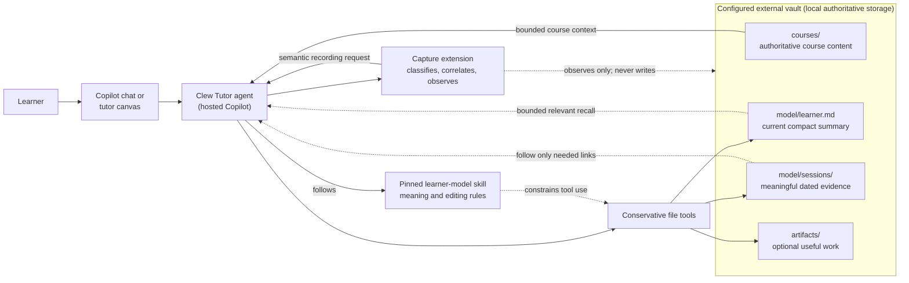
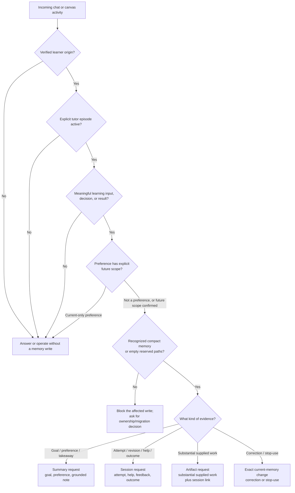
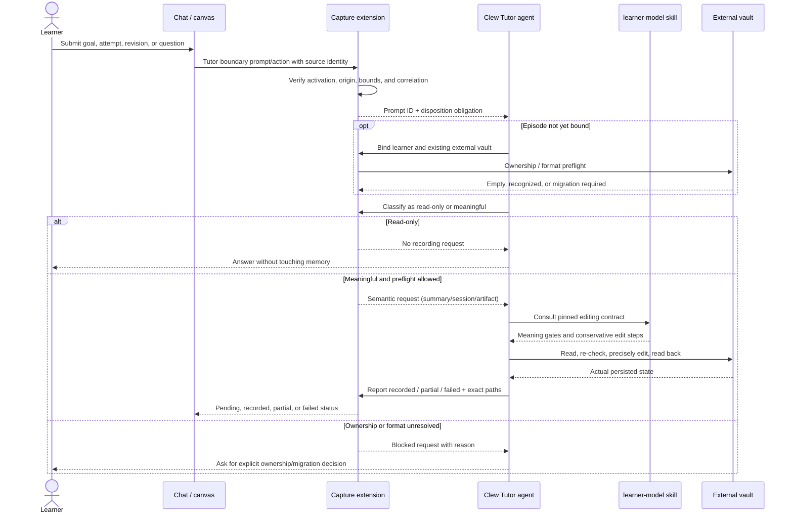
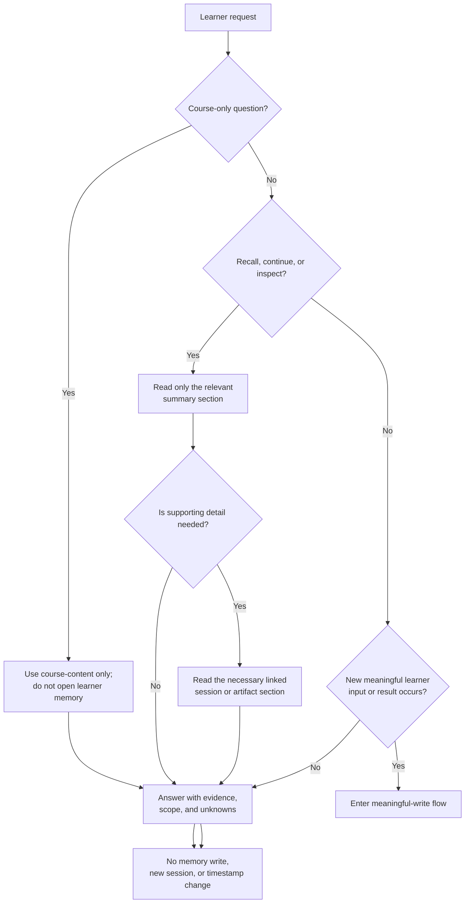
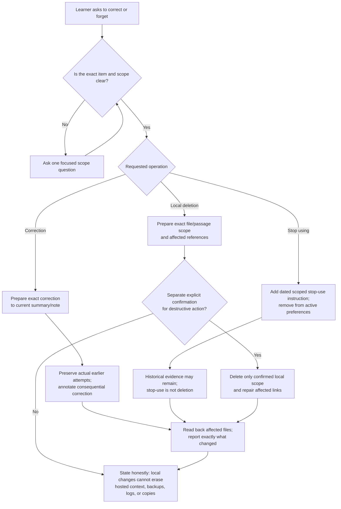

# Learner model: illustrated guide

Clew's learner model is a **small, readable learning memory** stored as Markdown
in an explicitly configured external vault. It is not a prediction engine, a
mastery graph, a transcript archive, or an automatic scheduler.

This guide explains the model for learners and contributors, then gives the
operational detail maintainers need to integrate it safely.

> [!IMPORTANT]
> The authoritative learner-model 3.0.0 contract remains the installed
> [specification](../.agents/skills/learner-model/references/learner-model-spec.md),
> [clarification gates](../.agents/skills/learner-model/references/clarification-gates.md),
> and [operational skill](../.agents/skills/learner-model/SKILL.md). Canonical
> package sources belong in
> [clew-skills](https://github.com/francesco-kruk/clew-skills), not in this
> explanatory guide.

## At a glance

- **One summary:** `model/learner.md` contains current goals, confirmed
  future-scoped preferences, and brief evidence-grounded learning notes.
- **Useful dated evidence:** `model/sessions/YYYY-MM-DD-topic.md` records
  meaningful attempts, help actually used, feedback, actual outcomes, and next
  steps.
- **Optional work products:** `artifacts/` stores substantial supplied or
  generated work only when retaining it is useful.
- **Meaningful writes only:** a genuine goal, decision, attempt, result,
  correction, or stop-use instruction can justify a write. Recall, inspection,
  configuration, and bare continuation do not.
- **Evidence stays attributable:** an original attempt is stored once and
  linked rather than copied into several files.
- **No inferred learner graph:** no numerical mastery, confidence, diagnosed
  misconception, learning-style label, automatic schedule, or domain taxonomy.
- **Local storage is not local-only inference:** bounded relevant content may be
  processed by hosted GitHub Copilot during an authorized task.

## Guide map

1. [Where the model lives](#1-where-the-model-lives)
2. [The compact file model](#2-the-compact-file-model)
3. [What causes a write](#3-what-causes-a-write)
4. [How chat and canvas capture become memory](#4-how-chat-and-canvas-capture-become-memory)
5. [How recall works without manufacturing evidence](#5-how-recall-works-without-manufacturing-evidence)
6. [Corrections, stop-use, and deletion](#6-corrections-stop-use-and-deletion)
7. [Safety, privacy, and failure behavior](#7-safety-privacy-and-failure-behavior)
8. [Unsupported models and claims](#8-unsupported-models-and-claims)
9. [Maintainer checklist](#9-maintainer-checklist)
10. [Contract sources and related design records](#10-contract-sources-and-related-design-records)

## 1. Where the model lives

The learner chooses an existing external vault outside this repository. Clew's
ignored `.clew.local.json` stores only its canonical absolute path:

```json
{
  "version": 1,
  "vault": "C:\\Path\\To\\Existing Vault"
}
```

Configuration does not create the vault, learner memory, courses, or artifacts.
It does not establish ownership of existing `model/` or `artifacts/` content.
Unknown or earlier layouts require an explicit ownership or migration decision
before affected writes.



The extension handles episode state, meaningful-write classification,
cross-surface correlation, and completion reporting. The **tutor agent remains
the writer** and follows the pinned learner-model skill when applying an edit.

## 2. The compact file model

### `model/learner.md`: current working summary

The file contains exactly one version marker:

```markdown
<!-- clew-learning-memory: v1 -->
# Learner

## Goals
- Understand eigenvectors well enough to solve the assignment
  (learner statement, 2026-09-20).

## Confirmed preferences
- For future calculus practice, ask me to attempt a problem before showing a
  worked solution (confirmed by learner, 2026-09-20).

## Learning notes
- Now checks the direction of approach before evaluating one-sided limits;
  the assisted retry was correct, but independent use is not yet known
  ([session](sessions/2026-09-20-one-sided-limits.md#outcome-and-next-step)).
```

These headings are recommended shapes, not required empty schema sections. Keep
the summary short. Full attempts and long histories belong in sessions or
artifacts, with links from the summary only when the current takeaway remains
useful.

### `model/sessions/YYYY-MM-DD-topic.md`: meaningful evidence

```markdown
# One-sided limits - 2026-09-20

## Attempt
For `lim x -> 2- f(x)`, the learner initially used the right-hand values and
answered `5`.

## Help and feedback
The tutor asked which side of `2` the sampled values came from. No answer was
supplied.

## Outcome and next step
The learner corrected the answer to `3` using the left-hand values. This was an
assisted retry; independent transfer to another graph remains unknown.
```

Use the actual recording date and a short Windows-safe topic. If a distinct note
with that name already exists, use `-2`, `-3`, and so on. Never overwrite a
different session or default to opaque UUID filenames.

### `artifacts/`: optional substantial work

An artifact is useful when the learner supplies or creates work worth retaining:
a proof, worksheet, essay draft, code sample, or generated practice set they
want to keep. Trivial conversation does not become an artifact.

The original attempt has one authoritative home. The storage topology is shown
in the first diagram above:

- short answer: store it in the session;
- substantial work: store it in an artifact and link it from the session;
- summary: keep only a brief grounded takeaway and evidence link.

## 3. What causes a write

### Study plans are separate work products

The first-party `study-plan` skill saves requested Markdown checklists in
`Learning/Plans/` inside the configured external vault. This location is not
part of learning memory v1 and does not change the pinned learner-model
contract. It is not a second evidence store or an automatic scheduler.

The student can edit TODOs in Obsidian; a tutor edit requires an explicit
request identifying the task. A checked box records task status, not demonstrated
understanding. Reading a plan or observing an exercise attempt must not
automatically update its checkboxes or infer a learning outcome from them.

Plan saves are reported separately from tutor capture, whose persisted paths
remain confined to `model/` and `artifacts/`. Genuine goals, decisions and
attempts can still justify their own compact memory updates; do not duplicate
the plan to manufacture a capture result. Synthesis, recall and repair use the
same existing tutor pathway rather than opening episodes or recording twice.
Saved synthesis cards remain optional artifacts, not evidence of learning.

Existing vault Git protection covers `model/` and `artifacts/`, not
`Learning/Plans/`. The initial plan workflow targets non-Git vaults; a
Git-managed plan destination requires an explicit privacy/tracking decision.
See [ADR-0007](adr/adr-0007-student-learning-skills-and-plans.md) and the
[implementation plan](plans/student-learning-skills.md).

### Meaningful learner activity

The model records **meaningful learning**, not all activity. The learner's
actual words, work, decisions, and observed results are evidence. Assistant
answers, generated exercises, quoted course text, system instructions, tool
output, passive UI changes, and agent-driven canvas actions are not learner
evidence.

| Activity | Result |
| --- | --- |
| Learner states a genuine goal | Update the summary; no session is required. |
| Learner explicitly confirms a future-scoped preference | Update the summary with scope and date. |
| Learner makes a meaningful attempt or revision | Record it once in a dated session, or link its artifact. |
| Learner requests and uses help | Record the help actually used with the attempt. |
| An actual outcome is observed | Record exactly what happened and what remains unknown. |
| Learner supplies substantial useful work | Save an artifact and link it from the session. |
| Learner corrects memory or says to stop using an item | Make a precise current-memory change after resolving scope. |
| Learner asks to continue, recall, inspect, configure, or view status | Read or answer only; create no memory and touch no timestamp. |



### Evidence language matters

Write what the evidence supports:

- "The assisted retry was correct" is supported.
- "The learner mastered limits" is not.
- "The learner requested short bullets for this answer" is current context.
- "The learner prefers short bullets in future statistics explanations" needs
  explicit future scope.
- "The learner answered `5`" must remain historically true even after a later
  corrected attempt.

## 4. How chat and canvas capture become memory

Selecting the Clew Tutor agent establishes the human learning boundary. The
extension then binds that episode to one learner and one configured vault. It
does not import preceding chat history.

For each prompt inside the explicitly selected tutor boundary:

1. the extension creates a bounded in-memory prompt identifier without storing
   the prompt text as a transcript archive;
2. the tutor binds the learner and vault first when the episode is not active;
3. the tutor classifies the prompt as read-only or meaningful;
4. meaningful activity becomes a **semantic recording request**;
5. the tutor applies that request through the learner-model skill;
6. the tutor reports the exact persisted paths, a partial result, or a failure;
7. status combines that report with best-effort inspection of the compact
   memory.



Chat and canvas use the same correlation path. The same attempt ID can combine a
canvas submission with a chat revision into one session request. A different
semantic target remains separate: for example, a takeaway about an attempt can
produce a linked summary update without duplicating the original attempt.

### Capture tools and responsibilities

| Extension operation | Responsibility |
| --- | --- |
| `clew_tutor_bind_session` | Verify explicit tutor selection and bind one learner to one existing external vault. |
| `clew_tutor_dispose_prompt` | Mark one prompt read-only or emit a bounded semantic request. |
| `clew_tutor_report_recording` | Report recorded, partial, or failed persistence with exact vault-relative paths. |
| `clew_tutor_capture_status` | Show episode, preflight, request, result, and best-effort completion state. |
| Headless canvas actions | Capture attributed attempts, hints, proposal responses, and revisions with source and attempt identity. |
| `clew_tutor_memory_inspect` | Read one bounded file under `model/` or `artifacts/`. |
| `clew_tutor_prepare_memory_change` | Prepare one exact correction or stop-use replacement; the agent applies it through the skill. |
| `clew_tutor_prepare_deletion` | Resolve deletion scope and consequences without deleting anything. |

The extension is not a filesystem sandbox. The agent profile and tool flow
support disciplined operation, while the pinned skill remains responsible for
the actual conservative edit.

## 5. How recall works without manufacturing evidence

Recall follows links outward only as far as the current question requires.



Examples:

- "What was my goal?" reads the Goals section only.
- "Continue the limits exercise" reads the current goal and latest relevant
  linked work, then offers the next activity without recording progress yet.
- "Explain the course definition of continuity" uses `course-content` and does
  not open learner memory.
- A later submitted answer is new meaningful evidence and can justify a session
  update.

Missing links, contradictory statements, or unknown outcomes are limitations to
state plainly, not permission to infer or scan the whole vault.

## 6. Corrections, stop-use, and deletion

These operations have different meanings:

- **Correction:** fix an inaccurate current statement or an explicitly
  identified transcription/feedback error. Preserve the learner's actual earlier
  answer unless that answer itself was misrecorded.
- **Stop using:** change current behavior or recall so an old preference or
  instruction is no longer active. Historical sessions can remain.
- **Local deletion:** remove an explicitly confirmed local passage or file and
  repair only the affected links and claims.



The current Clew Tutor extension exposes preparation for deletion, not a delete
operation. Destructive action remains separately confirmed under host rules.

## 7. Safety, privacy, and failure behavior

### Ownership and migration preflight

Writes are allowed when reserved paths are empty or when `model/learner.md`
contains exactly one recognized marker. Block the affected write when the vault
contains:

- old `profile.md` or `index.md` files;
- the earlier advanced/evidence-first layout;
- missing, unknown, conflicting, or duplicate markers;
- unrelated content in reserved paths whose ownership is uncertain.

Course reading remains independent and is not blocked by a learner-memory
migration question.

### Hosted processing boundary

Learner files remain local and portable, but relevant bounded content can enter
hosted Copilot context. Clew therefore:

- retrieves only what the current task needs;
- never bulk-uploads the learner model;
- does not access unrelated learners;
- collects no passive learner telemetry;
- grants no teacher or institutional access through this contract;
- promises no provider retention, training, deletion, encryption, or complete
  network audit behavior.

Local correction or deletion cannot recall content already processed by a host.

### Concurrency and partial failure

The learner-model skill uses ordinary conservative file tools, not a transaction
engine:

1. read the existing file;
2. preserve unrelated content;
3. re-read immediately before mutation;
4. stop on an unexpected concurrent change;
5. apply a precise edit;
6. read back the affected file and links.

If only part of a multi-file operation persists, report exactly which paths
changed and stop. Never claim rollback, exactly-once persistence, or success
shaped fallback behavior.

The capture extension keeps bounded state in memory only. A process termination,
reload, or session replacement can leave a learner-visible gap. Reload starts
inactive and requires a fresh explicit Clew Tutor selection; readable memory and
learner inspection are the backstop.

## 8. Unsupported models and claims

The compact contract deliberately does **not** create:

- profile/index files or a typed learner graph;
- observation, evidence, misconception, or change IDs;
- numerical confidence, mastery, durability, or efficacy;
- automatic review dates or spaced-repetition schedules;
- inferred learning styles, diagnoses, or stable traits;
- a global domain/concept taxonomy;
- overlay chains, suppression registries, or tombstones;
- a transactional writer, remote authoritative store, backup, or sync service.

If a feature needs one of these, it requires a new, explicitly reviewed
architecture rather than an ad hoc field in learner Markdown.

## 9. Maintainer checklist

Before shipping a learner-memory path, verify:

- [ ] The learner and existing external vault are explicit.
- [ ] Root Clew Tutor selection, not delegated invocation, establishes capture.
- [ ] Existing `model/` and `artifacts/` ownership passed preflight.
- [ ] The input is genuinely learner-authored and meaningful.
- [ ] A future preference has explicit future scope.
- [ ] The original attempt has one authoritative location.
- [ ] Summary claims link to the supporting evidence when support is needed.
- [ ] Recall and course-only reads make no writes.
- [ ] Requests and retrieval are bounded and do not form a transcript archive.
- [ ] Correction, stop-use, and deletion remain distinct.
- [ ] Destructive deletion has exact scope and separate confirmation.
- [ ] Partial failures report exactly what persisted.
- [ ] No pinned skill file or learner record is committed to this repository.

## 10. Contract sources and related design records

Earlier repository proposals can contain historical references to the removed
advanced/evidence-first learner graph. They are not alternate supported
runtimes. For current behavior, use the pinned 3.0.0 contract and the compact
boundary recorded in ADR-0004; preserve historical ADR text rather than silently
rewriting it as though it had always described this model.

- [Learner-model operational skill](../.agents/skills/learner-model/SKILL.md)
- [Learning memory v1 specification](../.agents/skills/learner-model/references/learner-model-spec.md)
- [Clarification gates](../.agents/skills/learner-model/references/clarification-gates.md)
- [ADR-0004: Compact learner memory and hosted processing](adr/adr-0004-compact-learner-memory-and-hosted-processing.md)
- [ADR-0005: Explicit tutor sessions and local evidence capture](adr/adr-0005-explicit-tutor-sessions-and-local-evidence-capture.md)
- [Learner evidence capture implementation plan](plans/learner-evidence-capture.md)
- [Clew Tutor extension guide](../.github/extensions/clew-tutor/README.md)
