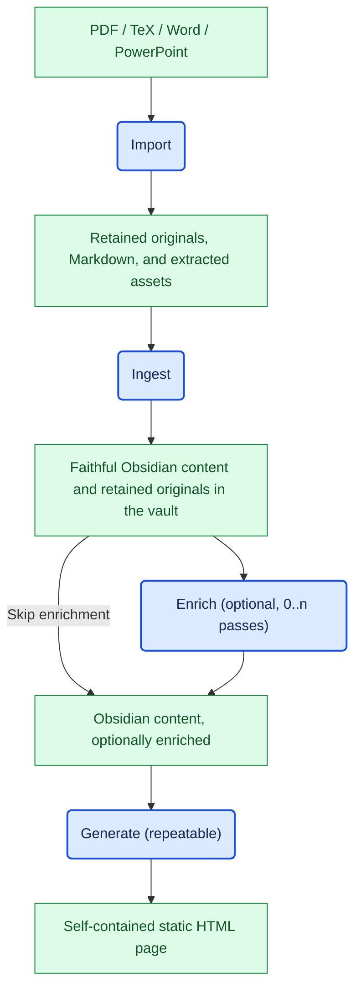

# ADR-0001: Document processing pipeline

- Status: Accepted
- Date: 2026-10-04

> **Current scope:** Later ADRs implement parts of this initial direction; see
> [Current refinements](#current-refinements). Non-PDF conversion and broader
> enrichment described below are not implemented.

## Context

Clew is a personalized learning assistant. It needs to turn course documents into
faithful, human-readable learning material, optionally enrich that material, and
publish it as a self-contained static HTML page.

The original material must remain available for reference and reprocessing.
Faithful ingestion must be distinct from enrichment so that readers and automated
processing can distinguish source content from added interpretations or exercises.
Publishing must not require repeating document conversion or enrichment.

This ADR records the initial architectural direction, not an assertion that the
pipeline is already implemented. The architecture will evolve as requirements and
implementation experience emerge.

## Decision

Use a pipeline with four distinct stages and persisted artifacts between them:

Blue rounded nodes represent processing steps; green rectangular nodes represent
content inputs and results. Enrich is optional: content can proceed directly to
Generate or undergo one or more enrichment passes first.

These are logical processing boundaries. This decision does not require separate
services, a particular execution framework, or specific conversion tools.

### 1. Import: convert and preserve

Import accepts PDF, TeX, Word, and PowerPoint source documents and converts them
into Markdown suitable for downstream processing in the intended architecture.
The first implementation is PDF-only, as scoped by ADR-0002.

- Retain the original source document in the Obsidian vault so that content
  produced by Ingest can reference it.
- Retain the converted Markdown, extracted figures, and other supporting assets
  needed to process the import again without repeating conversion.
- Preserve the association between the source, its Markdown, and its assets.
- Keep conversion separate from learning-content enrichment. Conversion is not
  an opportunity to summarize, correct, or add to the source.

The retained source also permits conversion to be rerun when import tooling
improves. Exact storage paths for import artifacts are not defined here.

### 2. Ingest: structure without changing content

Ingest takes Import's Markdown and assets and places their content into an
Obsidian vault structure. The output must be readable by a human and include
frontmatter and Dataview fields that support automated processing.

- Preserve the source content and meaning: do not summarize, paraphrase, correct,
  omit material, or introduce new learning content.
- Allow structural and representational changes needed for the vault, such as
  organizing notes, adding metadata, and resolving asset and source links.
- Reference the retained original source document from the ingested content.
- Keep figures and other imported assets accessible from the resulting notes.

The vault layout, note granularity, frontmatter schema, and Dataview fields remain
to be defined. Adding this structure must not be confused with enrichment.

### 3. Enrich: add learning value explicitly

Enrich consumes ingested content, or the result of a previous enrichment pass.
It may be skipped entirely or applied multiple times according to learning needs.

Enrichment can surface relationships, dependencies, and misconceptions, or
generate additional material such as exercises when the source course does not
provide enough.

- Produce the same human-readable Obsidian format, with the same metadata
  conventions, as Ingest.
- Make additions and interpretations distinguishable from source-derived content
  and traceable to the material they enrich.
- Preserve access to the faithful ingested content rather than silently replacing
  it with generated interpretations.
- Support subsequent enrichment passes without requiring another Import or
  Ingest run.

How enrichment provenance and revisions are represented is deferred. No specific
enrichment technique, model, or mandatory set of passes is selected by this ADR.

### 4. Generate: publish a repeatable view

Generate consumes the Obsidian content, whether enriched or not, and produces a
self-contained static HTML page.

- Map the HTML's internal structure to the Obsidian content so that generation
  remains straightforward and traceable.
- Include the resources needed to render and use the page without requiring
  Obsidian, Dataview, or an external runtime service. Source-document references
  are provenance links, not rendering dependencies.
- Treat HTML as a derived output, not the authoritative content store.
- Allow generation to be repeated from the selected vault content without
  rerunning earlier stages or changing that content.

The page's learning flow, features, visual design, and precise mapping from vault
content to HTML will be defined later.

## Consequences

- Persisted intermediate artifacts separate conversion, organization, enrichment,
  and publication, allowing downstream stages to be rerun independently.
- Original documents and faithful ingested content provide a reference against
  which enrichment can be reviewed.
- A shared Obsidian format lets Generate operate with zero or multiple enrichment
  passes rather than requiring a separate enriched-content format.
- Retaining originals, conversion artifacts, assets, and enrichment history has a
  storage and lifecycle-management cost.
- Conversion quality and content fidelity need validation; stage separation alone
  does not guarantee lossless extraction.
- Stable references, provenance, and rerun behavior require explicit contracts
  before implementation. Reprocessing must not silently discard reviewed or
  human-edited material.

## Alternatives considered

- **Direct source-to-HTML conversion:** fewer intermediate artifacts, but couples
  conversion to publication and bypasses the human-readable Obsidian content.
- **Combined ingestion and enrichment:** fewer stage boundaries, but makes it
  harder to distinguish faithful source content from generated additions.
- **Mandatory enrichment before generation:** simplifies one execution path, but
  prevents publishing faithful material without enrichment.

## Deferred decisions and evolution

Future decisions will define:

- Vault layout, note granularity, identifiers, and source-reference conventions.
- Frontmatter and Dataview schemas shared by Ingest and Enrich.
- Import tools, supported format variants, and handling of extraction failures.
- Enrichment provenance, revision tracking, and review mechanisms.
- Rerun semantics, change detection, and preservation of human edits.
- Pipeline invocation, orchestration, and artifact lifecycle management.
- HTML structure, embedded assets, source-link portability, learning flow, and
  interactive features.

Use subsequent ADRs to refine these contracts or change the pipeline. If a later
decision replaces this one, mark this ADR as superseded and link to its successor
rather than rewriting the historical rationale. Acceptance of this initial
direction does not freeze its implementation or the deferred choices.

### Current refinements

The following decisions resolve parts of the initial deferred list without
superseding the four-stage pipeline:

| Contract | Operative decisions |
| --- | --- |
| PDF conversion, retained bundles, discovery, and failure gates | [ADR-0002](0002-pdf-import-skill-and-project-runtime.md), with runtime ownership refined by [ADR-0003](0003-autonomous-portable-skills.md) and transcription/review refined by [ADR-0005](0005-conservative-import-and-latex-leakage-review.md). |
| Vault placement, note/field schemas, source references, fidelity, and ownership | [ADR-0004](0004-faithful-multi-bundle-ingest.md); Ingest retains a source subset, not the complete Import bundle. |
| First enrichment scope, provenance, and preservation checks | [ADR-0007](0007-course-linked-question-enrichment.md); additive aids and structural anchors, not generated exercises/answers or a revision-history framework. |
| Current-note publication, offline assets, discovery, and interactions | [ADR-0006](0006-current-note-offline-html-generation.md), extended by [ADR-0007](0007-course-linked-question-enrichment.md). |
| Note granularity and question/answer ownership across stages | [ADR-0008](0008-exercise-unit-pipeline-contract.md); one note per exercise/correction unit with anchored internal questions/answers, grouped by owning exercise in HTML. |

Non-PDF conversion, broader enrichment, incremental Ingest updates, general
revision tracking, and automated cleanup/orchestration remain deferred.
The current user workflow is in the [README](../../README.md); runtime and
development details are in the [skills reference](../skills.md).
